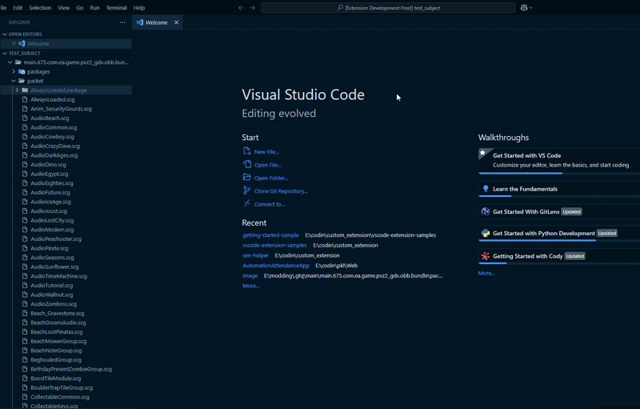

# Sen Helper

Integrates Sen into VScode.

## Run most used Sen command directly in vscode

### Comes with 2 types of processes

Right click and simple.

> Disclaimer: This method is currently only supports one file handling.

Via command pallete (`CTRL+Shift+P` or `F1`).

> Note: Hold `Shift` or `Ctrl` for choosing multiple files.

## Requirements

- Sen: Environment.
- Visual Studio Code 1.98 or newer.

### How to Set up Sen Helper

Have `Sen: Environment` installed, Install [here](https://harumazzz.github.io/Sen.Environment/download) if you haven't already.

After that, open command pallete (`F1` or `Ctrl+Shift+P`), run command `Sen: Set Sen Directory`, and set the base path for the extension to use under the hood.

## Available Commands

### SCG Commands

- `Sen: Unpack SCG (For Modding)`: Unpacks multiple SCGs (For Modding option).
  - Manually sets whether or not the unpacked SCGs will have split label by default.
- `Sen: Pack SCG (For Modding)`: Packs multiple SCGs (For Modding option).
  - This extension will automatically checks whether or not the packed SCGs will contains split label, would automatically assumes that the SCGs will have split label if `#split_label` doesn't exists in the `data.json`.
- `Sen: Unpack SCG (Simple)`: Unpacks multiple SCGs (Simple option).
- `Sen: Pack SCG (Simple)`: Packs multiple SCGs (Simple option).

### Animation Commands

- `Sen: Pam to Flash (xfl)`: Converts `.pam` files into `.xfl` folders to be processed with Adobe Animate later.
  - Manually sets whether or not the converted `.pam` would contains split label by default.
- `Sen: Flash (xfl) to Pam`: Converts `.xfl` folders into `.pam` files.
  - This extension will search for `label` folder to decide whether or not the animation contains "Split Label" by default.
- `Sen: Pam to JSON`: Converts `.pam` files into `.pam.json` files.
- `Sen: JSON to Pam`: Converts `.pam.json` into `.pam` files.

### OBB Commands

- `Sen: Unpack OBB`: Unpacks PvZ2's OBB/RSB via "Init Project".
  - Manually decide which "Texture Category" will be used by default.
- `Sen: Pack OBB`: Packs PvZ2's OBB/RSB via "Init Project".
  - Manually decide which "Texture Category" will be used by default.

### Json Commands

- `Sen: RTON to JSON`: Converts `.rton` files to `.json`.
- `Sen: JSON to RTON`: Converts `.json` files to `.rton`.

### Extension Specific Commands

- `Sen: Open GUI`: Opens SUI.
- `Sen: Set Sen Directory`: Set the sen path this extension will use under the hood.
- `Sen: Open Sen Directory`: Opens the folder this extension use under the hood.

## Extension Settings

This extension contributes the following settings:

### Path Specific Settings

- `sen-helper.senPath`: Manually sets the path extension used for running sen under the hood, run `sen-helper.extension.senSenPath` command instead for better experience.
- `sen-helper.suiPath`: The path extension used for opening SUI.

### Command Specific Settings

- `sen-helper.configScgForModding`: Set configuration for the command `Sen: Pack SCG (For Modding)`.
- `sen-helper.configPamToFlash`: Set configuration for the command `Sen: Pam to Flash (xfl)`.
- `sen-helper.configFlashToPam`: Set configuration for the command `Sen: Flash (xfl) to Pam`.
- `sen-helper.configOBBFunction`: Set configuration for the command `Sen: Unpack OBB` and `Sen: Pack OBB`.

## Known Issues

If you found any issues regarding this extension, you can create an issues [here](https://github.com/Zidan1146/sen-helper/issues). You can write your ideas and suggestion here as well, as long it's practical and interesting enough I'll add the said suggestion into the extension.

## Troubleshoots

Why I can't run these commands?

> Make sure that your Sen path is already set.

> Or you can select "Select Path" to set the sen path, this button runs `Sen: Set Sen Directory` command under the hood.

## Credits

[Lotus icons created by Freepik - Flaticon](https://www.flaticon.com/free-icons/lotus").

Haruma for all the help and support while making this extension.

## License

[MIT](LICENSE)
